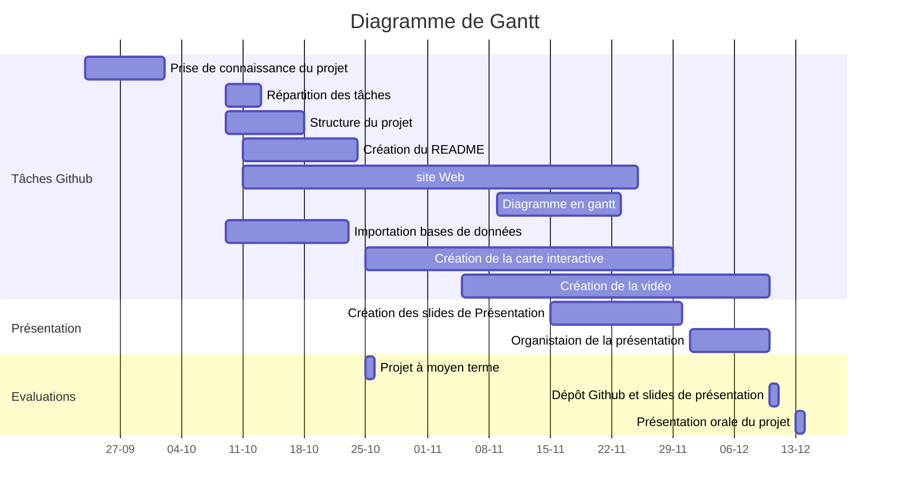

```mermaid
gantt
title Diagramme de Gantt
dateFormat DD-MM
axisFormat %d-%m


section Tâches Github
Prise de connaissance du projet: Terminer,23-09,9d
Répartition des tâches : Terminer, 09-10, 4d
Structure du projet : Terminer, 09-10, 9d
Création du README:Terminer,11-10,13d
site Web: En cours, 11-10, 45d
Diagramme en gantt : Terminer , 09-11, 14d
Importation bases de données: Terminer, 09-10, 14d
Création de la carte interactive: En cours, 25-10,35d
Création de la vidéo : En cours, 05-11, 35d

section Présentation
Création des slides de Présentation: En cours, 15-11,15d
Organistaion de la présentation: En cours,01-12,9d

section Evaluations
Projet à moyen terme  : 25-10, 1d
Dépôt Github et slides de présentation :10-12,1d
Présentation orale du projet : 13-12, 1d
```